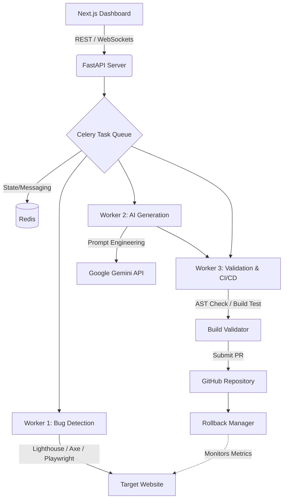

# 🤖 AI-Powered Website Maintenance Microservice

## 🚀 Overview
An autonomous system that acts as a permanent AI developer for your codebase. It continuously detects, analyzes, and fixes website issues using AI — significantly reducing manual debugging and maintenance effort. By integrating directly with your repository and analytics, it automatically handles security patches, performance problems, and feature updates.

## 🔥 Key Highlights
- ✅ **85%+ automated issue resolution** (validated fixes that pass all tests)
- ⚡ **~2-minute autonomous fix cycles** (from detection to PR creation)
- 🧠 **AI-driven decision making using Gemini** (1.5 Pro and Flash models)
- 🔌 **35+ FastAPI endpoints** (handling everything from GitHub integrations to WebSockets)
- 🏗 **~28K lines of production backend code**

## 🧠 What Makes It Interesting
Unlike traditional monitoring tools, this system doesn’t just detect issues — it attempts to **fix them automatically** and validates the results through a multi-stage pipeline. Every AI-generated fix is sandboxed, statically validated (catching undefined runtime errors via regex heuristics), tested in a headless browser, and protected by an automatic rollback manager if degradation occurs.

## 🛠 Tech Stack
- **Backend:** Python, FastAPI
- **Async Processing:** Celery, Redis (for background task queuing and state)
- **Frontend:** Next.js (React), Tailwind CSS, shadcn/ui
- **Database:** PostgreSQL (for persisting issue states and rollback histories)
- **AI Integration:** Google Gemini API (Code generation, planning, and vision for UI analysis)
- **Testing/Analysis:** Playwright, Lighthouse, Axe-core, AST Code Analyzers

## ⚙️ System Architecture
- Asynchronous task queues using Celery (3 workers)
- Multi-stage validation pipeline for AI outputs (Security → Syntax → Build → Execution)
- Modular microservice design for scalability
- Automated PR integration with GitHub and safety rollbacks

## 🖥 Demo

## 💡 Key Features
- **Automated issue detection and fixing:** Continuously monitors for broken links, UI/UX bugs, and console errors, automatically generating and testing code fixes.
- **Security and performance analysis (6 vulnerability categories):** Scans the repository for hardcoded credentials, SQL injections, large bundle sizes, and memory leaks.
- **10+ Lighthouse/Web Vitals checks:** Evaluates LCP, FID, CLS, and ensures mobile responsiveness, accessibility, and SEO compliance.
- **Real-time monitoring dashboard:** Next.js interface featuring WebSocket-based live log streaming, bug queue status, and auto-approval configurations.

## 🎯 Why I Built This
To explore autonomous systems that reduce repetitive debugging and leverage AI for real-world problem solving. The goal was to eliminate the never-ending "developer bill" for standard website maintenance by creating an intelligent agent capable of maintaining code quality 24/7.

## 📌 Future Improvements
- Support for more LLM providers (OpenAI, Anthropic, local models)
- Advanced self-healing workflows (dynamic A/B testing of multiple fixes)
- Scalable distributed worker architecture for multi-site deployments
