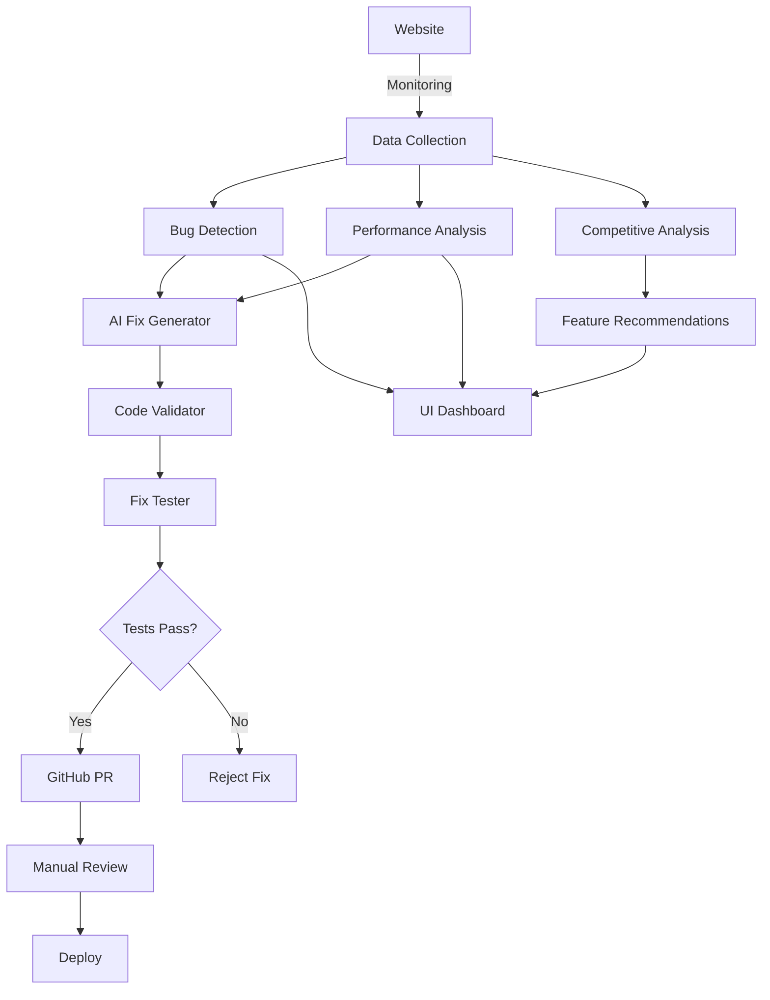

# Architecture Documentation

## System Overview

The AI Engine Microservice follows a **modular, event-driven architecture** with clear separation of concerns between monitoring, analysis, fix generation, validation, and deployment.



## Core Components

### 1. Monitoring & Detection Layer

#### Enhanced Bug Detector (`enhanced_bug_detector.py`)

**Purpose**: Comprehensive bug detection across multiple dimensions

**Detects**:

- Lighthouse performance issues (LCP, FID, CLS)
- Axe accessibility violations (WCAG compliance)
- JavaScript console errors
- Network failures
- Responsive design issues

**Technology**: Playwright for browser automation

#### Competitive Analyzer (`competitive_analyzer.py`)

**Purpose**: Analyzes competitor websites to identify feature gaps

**Process**:

1. Scrapes competitor websites using Playwright
2. Extracts features using AI vision (Gemini Vision API)
3. Compares with your site's features
4. Generates prioritized recommendations

**Output**: Feature gaps with priority scores, effort estimates, business impact

### 2. Analysis & Decision Layer

#### Analyzer (`analyzer.py`)

**Purpose**: Central coordinator for all analysis types

**Responsibilities**:

- Orchestrates bug detection workflows
- Processes Google Analytics data
- Coordinates performance audits
- Manages competitive analysis

**Input**: Site data, repository files
**Output**: Structured issue list with metadata

### 3. Fix Generation Layer

#### Generator (`generator.py`)

**Purpose**: AI-powered code fix generation

**Modes**:

1. **Bug Fixing**: Modifies existing files to fix bugs
2. **Utility Creation**: Creates new utility files for optimizations

**AI Integration**: Uses Gemini API for context-aware code generation

#### Improved Fixer (`improved_fixer.py`)

**Purpose**: Incremental, intelligent bug fixing

**Features**:

- Context-aware fixes based on file analysis
- Minimal code changes
- Preserves existing functionality
- Targets specific bugs without side effects

### 4. Validation & Safety Layer

#### Code Validator (`validator.py`)

**Purpose**: Multi-layer validation of generated fixes

**Checks**:

1. **Safety Validation**: No dangerous patterns (eval, delete, rm -rf)
2. **Syntax Validation**: Basic syntax correctness
3. **File Type Validation**: Appropriate for modification
4. **Utility File Validation**: Only safe locations for new files

**Rejection Criteria**:

- Code contains dangerous patterns
- Attempts to modify framework/vendor files
- Invalid syntax or structure
- Missing required context

#### Fix Tester (`fix_tester.py`)

**Purpose**: Isolated testing of fixes before deployment

**Test Types**:

1. **Syntax Tests**: JavaScript/Python syntax validation
2. **Execution Tests**: Run code in isolated environment
3. **Browser Tests**: Test browser compatibility
4. **HTML Validation**: Check HTML structure

**Special Handling**:

- Skips Node.js tests for browser-only code
- Detects TypeScript/JSX and adjusts validation
- Handles utility files separately

### 5. Deployment Layer

#### GitHub Handler (`github_handler.py`)

**Purpose**: Automated GitHub integration

**Functions**:

- Clone/pull repository
- Create feature branches
- Commit and push changes
- Create pull requests with detailed descriptions

**Safety**: All changes go through PR workflow for manual review

#### Rollback Manager (`rollback_manager.py`)

**Purpose**: Automatic rollback protection

**Features**:

- Monitors site health after deployments
- Tracks change history
- Creates rollback PRs if issues detected
- Maintains audit trail

### 6. API & UI Layer

#### FastAPI Server (`main_with_config.py`)

**Purpose**: REST API for all functionality

**Key Endpoints**:

- `/run` - Trigger maintenance cycle
- `/status` - Get system status
- `/analyze-competitors` - Run competitive analysis
- `/feature-recommendations` - Get recommendations
- `/ws/logs` - WebSocket for real-time logs

#### Next.js UI (`ai-engine-ui/`)

**Purpose**: User-friendly web interface

**Features**:

- Real-time log streaming
- Configuration management
- Bug visualization
- Feature recommendation display with natural language summaries
- System status monitoring

## Data Flow

### Maintenance Cycle Flow

```
1. User triggers /run
2. collect_site_data() gathers metrics
3. analyze_data() processes and categorizes issues
4. prepare_fixes() generates fixes using AI
5. validate_all_fixes() checks safety
6. test_fixes() runs in sandbox
7. submit_fix_pr() creates GitHub PR
8. Monitor for issues → auto-rollback if needed
```

### Competitive Analysis Flow

```
1. User triggers /analyze-competitors
2. competitive_analyzer extracts features from competitors
3. feature_extractor identifies features using AI
4. Compare with own site features
5. Calculate priority scores
6. Store results globally
7. Display in UI with natural language summary
```

## Technology Stack

### Backend

- **FastAPI**: Modern async Python web framework
- **Playwright**: Browser automation and testing
- **Lighthouse**: Performance auditing
- **Axe-core**: Accessibility testing
- **PyGitHub**: GitHub API integration

### Frontend

- **Next.js 14**: React framework with App Router
- **shadcn/ui**: Component library
- **TailwindCSS**: Utility-first CSS

### AI & ML

- **Google Gemini**: Code generation and feature detection
- **Gemini Vision**: Visual feature extraction

### Testing & Validation

- **pytest**: Python testing framework
- **Node.js**: JavaScript syntax validation

## Security Considerations

1. **Code Validation**: All AI-generated code validated before execution
2. **Sandbox Testing**: Fixes tested in isolated environment
3. **Manual Review**: Changes require PR approval
4. **Rollback Protection**: Automatic rollback if issues detected
5. **Audit Logging**: All actions logged with timestamps
6. **Environment Isolation**: Secrets managed via environment variables

## Scalability

### Current Architecture

- Single-instance FastAPI server
- Synchronous fix generation
- In-memory state for competitive analysis

### Future Enhancements

- **Queue-based processing** for concurrent fix generation
- **Database storage** for analysis results persistence
- **Horizontal scaling** with load balancer
- **Caching layer** for repeated analyses
